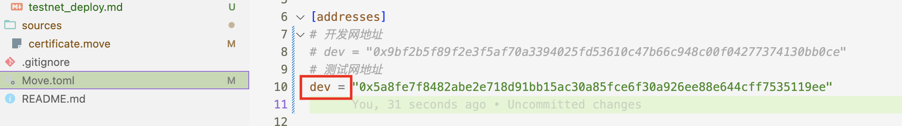

# Move To Learn NFT 项目说明

## 1. Aptos CLI 初始化

```bash
aptos init
```

## 2. 领取测试币

```bash
aptos account balance
```

## 3. Move 合约编译

```bash
aptos move compile
```

## 4. Move 合约发布

```bash
aptos move publish --assume-yes
```

## 5. Move 初始化
```bash
aptos move run --function-id {账户地址}::certificate::initialize --args hex:{公钥} --profile default
```

#### 例如
```bash
aptos move run --function-id 0x5a8fe7f8482abe2e718d91bb15ac30a85fce6f30a926ee88e644cff7535119ee::certificate::initialize --args hex:4d03e5f59e808d81d5e1c5667211822d7c02d365e4958a8b8b2b1fb130db1572 --profile default
```

注意：这里的`dev`不要变，直接改参数变量
